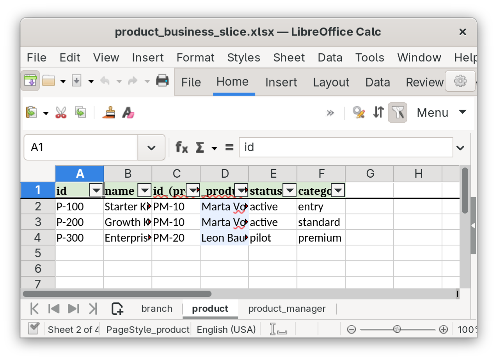
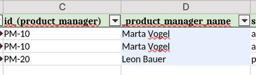
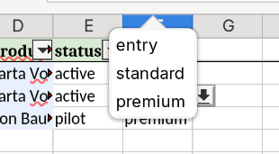
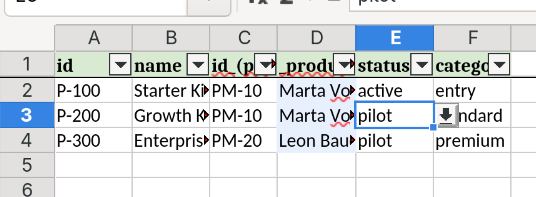

= Product Business Slice

This is the first curated demo slice. It gives us a small but expressive business model
for end-to-end demo and release verification.

== Theme

The slice uses three related tables:

* `product`
* `product_manager`
* `branch`

Relationship shape:

* product n:1 product_manager
* product_manager n:1 branch

== Why This Slice Exists

It is small enough to understand quickly, but rich enough to show visible spreadsheet
behavior:

* multiple sheets
* FK helper columns
* list validations
* per-sheet overrides
* JSON -> XLSX -> JSON re-import roundtrip

== Artifacts

Dataset:

* `data/product_business_slice/product.json`
* `data/product_business_slice/product_manager.json`
* `data/product_business_slice/branch.json`
* `data/product_business_slice/overrides.yaml`

Pipeline:

* `pipelines/demo_product_business_slice.yaml`

Command:

[source,bash]
----
make run PIPELINE=./pipelines/demo_product_business_slice.yaml
----

== Source Data

The central business table is `product.json`:

[source,json]
----
[
  {
    "id": "P-100",
    "name": "Starter Kit",
    "id_(product_manager)": "PM-10",
    "status": "active",
    "category": "entry"
  }
]
----

The important part is `id_(product_manager)`. That is the FK-style column that allows
the pipeline to derive a helper column from the `product_manager` table.

The second relation lives in `product_manager.json`:

[source,json]
----
[
  {
    "id": "PM-10",
    "name": "Marta Vogel",
    "id_(branch)": "B-001",
    "email": "marta.vogel@example.test"
  }
]
----

That gives us a transitive business story:

* a product belongs to a product manager
* a product manager belongs to a branch

== Overrides

The slice also includes sheet-specific rendering overrides:

[source,yaml]
----
defaults:
  auto_filter: true
  freeze_header: true

sheets:
  product:
    header_fill_rgb: "#D9EAD3"
  product_manager:
    header_fill_rgb: "#CFE2F3"
  branch:
    auto_filter: false
    freeze_header: false
    header_fill_rgb: "#FCE5CD"
----

This gives us one workbook with visible differences between sheets instead of a uniform
"same everywhere" export.

== Pipeline

The pipeline combines six ideas in one small flow:

* `apply_overrides` injects workbook and sheet rendering options
* `validate` checks duplicate IDs and missing FK targets
* `add_validations` adds Excel list validations
* `infer_fk_relations` writes the v2 FK relation policy under
  `_meta.helper_policies.fk` from the `id_(<target>)` cell convention --
  this is the configuration step the FK-helper primitives consume
* `add_fk_helpers` materializes helper columns from that policy (and
  `reorder_fk_helpers` places them next to their FK column)
* `flatten_headers` keeps re-imported JSON readable on the way back

`add_fk_helpers`, `reorder_fk_helpers`, `validate_fk_helpers`, and
`remove_fk_helpers` are policy *consumers*: they read the v2 relation
policy and the derived helper provenance written by `add_fk_helpers`.
A pipeline that uses any of them must therefore run a policy *producer*
first -- either `infer_fk_relations` (heuristic, as in this slice) or
`configure_fk_helpers` (explicit / manual policy).

The relevant shape is:

[source,yaml]
----
pipeline:
  - step: apply_overrides
    overrides_path: ./data/product_business_slice/overrides.yaml

  - step: validate
    mode_duplicate_ids: warn
    mode_missing_fk: warn
    defaults:
      id_field: id
      label_field: name
      detect_fk: true
      helper_prefix: "_"

  - step: add_validations
    rules:
      - sheet: product
        column: status
        rule:
          type: in_list
          values: [active, pilot, retired]

  - step: infer_fk_relations
    mode: naming_convention
    id_columns: [id]
    fk_patterns:
      - "id_({target})"
    target_label_fields: [name]

  - step: add_fk_helpers

  - step: reorder_fk_helpers
    helper_prefix: "_"
----

== What To Look For In Excel

The generated workbook has three visible business sheets with distinct
per-sheet styling. Image references in this section render in the
AsciiDoc HTML output and on the demo repository's GitHub view; the
published Reveal.js deck currently omits them (see screenshot
publishing policy in `docs/screenshots/README.md`).

ifndef::backend-revealjs[]

endif::[]

On `product`:

* helper column `_product_manager_name` next to `id_(product_manager)`:
+
ifndef::backend-revealjs[]

endif::[]
* list validations on `status` (`active` / `pilot` / `retired`) and on
  `category` (`entry` / `standard` / `premium`):
+
ifndef::backend-revealjs[]

endif::[]
* filter enabled
* freeze enabled

On `branch`:

* list validation on `country` (`DE` / `CH` / `AT`)
* filter disabled
* freeze disabled
* distinct header styling via sheet override

== What Comes Back On Re-import

The reimport pipeline (`pipelines/demo_workbook_reimport.yaml`) reads the
edited workbook and writes canonical JSON. It runs `remove_fk_helpers`
so derived helper columns are stripped before the JSON is written:

[source,yaml]
----
pipeline:
  - step: remove_fk_helpers
    prefix: "_"
----

`remove_fk_helpers` reads the derived helper provenance that
`add_fk_helpers` wrote into the workbook on the forward pass (the
provenance survives the XLSX roundtrip via persisted `_meta`). It then
drops exactly the columns recorded in that provenance -- no
classification by column-name prefix. The `prefix` parameter is kept
for backwards compatibility but is not the discovery mechanism;
provenance is.

That means:

* business edits in non-helper cells survive the round-trip; for example
  changing a `status` from `active` to `pilot` shows up in the reimported
  `product.json` exactly as edited;
* helper columns (`_product_manager_name`, `_branch_name`, ...) do not
  leak into the canonical JSON, even though they were visible in the
  workbook;
* `data/product_business_slice/overrides.yaml` and any sidecar
  `_meta.yaml` are workbook-rendering configuration, not business
  payload, and are correctly absent from the reimported `json_dir`
  output.

This is the property the eight-step first-hour tutorial in the demo
`README.md` asks you to verify in its final step (`diff` of the source
and reimported JSON should show only the field you edited).

ifndef::backend-revealjs[]

endif::[]

== Why This Is A Good First Slice

This slice is intentionally not maximal. It works as the first benchmark because it
already combines:

* business-readable source data
* visible spreadsheet UX
* validation behavior
* FK-driven enrichment
* clean roundtrip behavior

That makes it a strong base for later additions such as summary sheets, named ranges,
or multi-header examples.

== Current Notes

Helper columns are visible inside the workbook (the forward pipeline runs
`add_fk_helpers` + `reorder_fk_helpers`) but are stripped on the way back
to JSON (the reimport pipeline runs `remove_fk_helpers`). That asymmetry
is intentional: helpers exist to make the workbook readable for humans,
not to alter the canonical JSON model.
